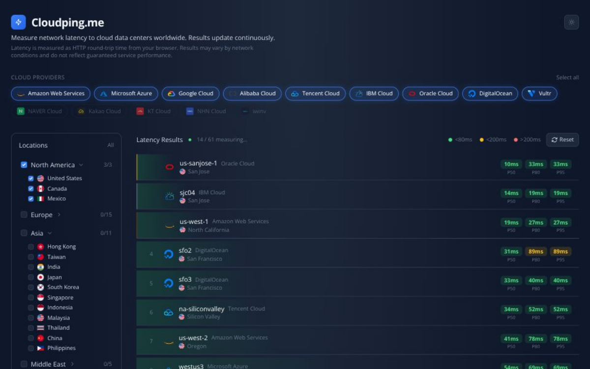

# ⚡ Cloudping.me

Real-time browser-based latency tester for **14 cloud providers** — including AWS, Azure, GCP, and Korean CSP providers.

🌐 **[cloudping.me](https://cloudping.me)**



## Features

- 🌍 14 cloud providers, 300+ regions worldwide
- 📊 Real-time latency with P50 / P80 / P95 percentiles
- 🔍 Filter by provider and geographic location
- 🌙 Dark / Light theme toggle
- 🇰🇷 Korean CSPs: NAVER Cloud, Kakao Cloud, KT Cloud, NHN Cloud, iwinv

## Cloud Providers

AWS · Azure · GCP · Alibaba Cloud · Tencent Cloud · IBM Cloud · Oracle Cloud · DigitalOcean · Vultr · NAVER Cloud · Kakao Cloud · KT Cloud · NHN Cloud · iwinv

## Getting Started

```bash
npm install
npm run dev
```

Open [http://localhost:3000](http://localhost:3000).

## Based on

[webping.cloud](https://github.com/goenning/webping.cloud) by [@goenning](https://github.com/goenning)
