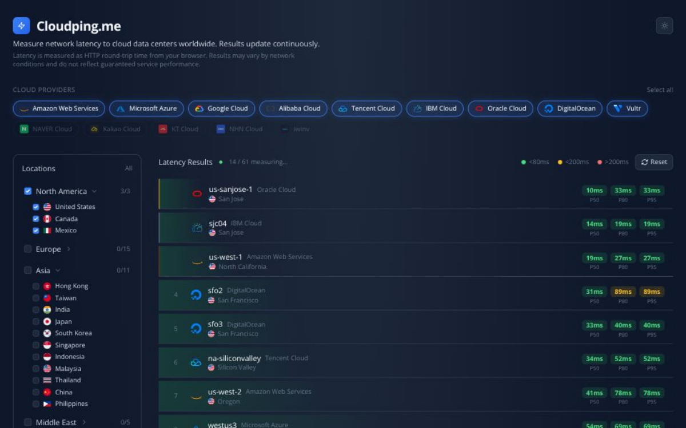

# ⚡ Cloudping.me

Real-time browser-based latency tester for **15 cloud providers** — including AWS, Azure, GCP, Akamai Cloud, and Korean CSP providers.

🌐 **[cloudping.me](https://cloudping.me)**



## Features

- 🌍 15 cloud providers, 300+ regions worldwide
- 📊 Real-time latency with P50 / P80 / P95 percentiles
- 🔍 Filter by provider and geographic location
- 🌙 Dark / Light theme toggle
- 🇰🇷 Korean CSPs: NAVER Cloud, Kakao Cloud, KT Cloud, NHN Cloud, iwinv

## Cloud Providers

AWS · Azure · GCP · Alibaba Cloud · Tencent Cloud · IBM Cloud · Oracle Cloud · DigitalOcean · Akamai Cloud · Vultr · NAVER Cloud · Kakao Cloud · KT Cloud · NHN Cloud · iwinv

## Getting Started

```bash
npm install --omit=optional
npm run dev
```

Open [http://localhost:3000](http://localhost:3000).

The latency tester only needs Next.js and React. Site URL, Google Analytics, and Vercel Analytics/Speed Insights are production-only and live in the Vercel project env — not in this repo.

| | App (OSS) | Production site |
|---|---|---|
| `next`, `react`, `react-dom` | required | required |
| `@vercel/analytics`, `@vercel/speed-insights` | omit | `optionalDependencies` + `NEXT_PUBLIC_SITE_TELEMETRY=1` |
| `NEXT_PUBLIC_SITE_URL` | unset | Vercel env (canonical / Open Graph) |
| `NEXT_PUBLIC_GA_ID` | unset | Vercel env |

See `.env.example`. Local clones do not send analytics.

## CLI

Ping the same regions from the terminal. Data comes from `src/data/datasource`, not from the website API.

```bash
go run ./cli
go run ./cli -geo Asia
go run ./cli -provider aws,linode
go run ./cli -c 6
```

## Based on

[webping.cloud](https://github.com/goenning/webping.cloud) by [@goenning](https://github.com/goenning)
